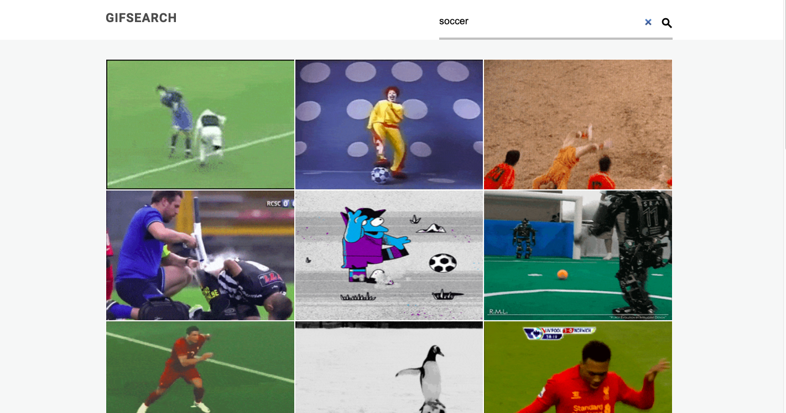

# gif_search_app

Gif search application using React.

## Example

## Components

### App.js

    App.js is the main class componenet of the application and stores the application state. This component uses axios to fetch data from the api. Calling both GifList and SearchForm components.

### GifList.js

    The GifList functional componenet takes in data using props and calls the Gif component for each gif retrieved from the api or the NoGif component if there are no gifs in the props data.

### Gif.js

    The Gif functional component takes in a url as a prop and displays an image of the gif passed to it.

### NoGifs.js

    The NoGifs functional component displays a message stating no gifs were found.

### SearchForm.js

    The SearchForm functional component uses a react ref to take data from the input element and passes it to a callback function recieved as a prop to App.js.

## Table of Contents

- [gif_search_app](#gif_search_app)
  - [Example](#example)
  - [Components](#components)
    - [App.js](#appjs)
    - [GifList.js](#giflistjs)
    - [Gif.js](#gifjs)
    - [NoGifs.js](#nogifsjs)
    - [SearchForm.js](#searchformjs)
  - [Table of Contents](#table-of-contents)
